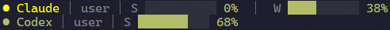

# pi-cliproxy-usage

Compact CLIProxyAPI account usage meters for Pi Coding Agent.

Shows one colored line below editor per enabled account:

```text
● Claude │ user │ S ███████░░░ 70%  │  W ████░░░░░░ 40%
● Codex │ user │ S █████████░ 90%
● Grok │ user │ W █████░░░░░ 50%
```

Percentages and filled bars show usage **consumed**. Colors shift green → yellow at 70% → red at 90%. Codex intentionally shows Session only; weekly meter is omitted.

## Requirements

- [Pi Coding Agent](https://github.com/earendil-works/pi)
- [CLIProxyAPI](https://github.com/router-for-me/CLIProxyAPI) with at least one Claude, Codex, or Grok account configured

## Install

```bash
pi install npm:pi-cliproxy-usage
```

After installing or updating, run `/reload` in Pi.

Or test directly:

```bash
pi -e ./index.ts
```

## Settings

User file: `<getAgentDir()>/pi-cliproxy-usage.json` (normally `~/.pi/agent/pi-cliproxy-usage.json`). Missing file uses defaults. Changes from interactive UI apply immediately. Settings reload on session start and `/reload`.

Older `~/.pi/agent/extensions/pi-cliproxy-usage/config.json` files migrate automatically when canonical file does not exist.

```json
{
  "accountsDir": "~/.cli-proxy-api",
  "refreshMinutes": 5,
  "maxVisibleAccounts": 4,
  "providers": {
    "claude": true,
    "codex": true,
    "grok": true
  }
}
```

Extension reads top-level CLIProxyAPI auth JSON files with `type` equal to `claude`, `codex`, or `xai`. Disabled auth files are skipped. Credentials stay local and are sent only to official provider usage endpoints documented by OpenUsage.

Accepted values: `accountsDir` is a non-empty string; `refreshMinutes` and `maxVisibleAccounts` are integers of at least `1`; provider values are booleans. Widget prioritizes errors, then accounts with highest usage, and shows an overflow row when more accounts exist. Invalid values are ignored with a warning. Unknown fields are preserved when saving.

## Commands

- `/cliproxy-usage` — refresh and show detailed percentages
- `/cliproxy-usage settings` — interactively edit refresh interval and provider toggles
- `/cliproxy-usage status` — show effective values, source, and settings path
- `/cliproxy-usage help` — show commands and manual settings path
- `/cliproxy-usage config` — compatibility alias for `settings`

Token refresh is deliberately left to CLIProxyAPI. If provider returns `401`/`403`, let CLIProxyAPI refresh account or log in again.

## Screenshot



## Support

Report bugs and request features in [GitHub Issues](https://github.com/Villoh/pi-cliproxy-usage/issues).
